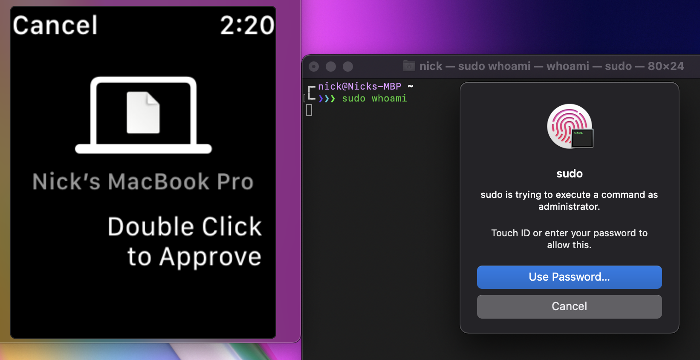

# pam_wtid

`pam_wtid` is a patching utility used to add support to Apple's `pam_tid` PAM module for watch authentication in addition to Touch ID. If you have a watch paired to your Mac or fingerprints enrolled for unlocking, you can use this module to authenticate sudo.

## Screenshot



## Install

`make enable` will patch the exisitng `pam_tid` binary on your system (found in `/usr/lib/pam/`), and place a modified version of `pam_wtid` in `/usr/local/lib/pam`. It will also modify `/etc/pam.d/sudo` to enable the PAM module.

`make disable` will remove the patched binary and revert the changes in `/etc/pam.d/sudo`.

## Why

There are already a lot of really cool, open source PAM modules/utilities that add Tocuh ID and watch authentication to `sudo`. To name a few:

- [mattrajca/sudo-touchid](https://github.com/mattrajca/sudo-touchid) – A `sudo` fork that adds Touch ID support
- [artginzburg/sudo-touchid](https://github.com/artginzburg/sudo-touchid) – Utility to automatically install Apple's native `pam_tid` PAM module
- [Reflejo/pam-touchID](https://github.com/Reflejo/pam-touchID) – A Swift PAM module for adding Touch ID support
- [biscuitehh/pam-watchid](https://github.com/biscuitehh/pam-watchid) - A Swift PAM module for adding watch unlocking support (forked from the above)
- Apple's own [pam_tid](https://github.com/apple-open-source/macos/tree/master/pam_modules/modules/pam_tid), available in `/usr/lib/pam/pam_tid.so.2` for Touch ID authentication

When my computer is docked in clamshell mode, I can only use watch unlocking. But if I am on the go, I want to use Touch ID over watch unlocking since it is usually quicker. I used to use `pam-watchid`, but on my new 2021 16" MacBook Pro only watch support works. Doing a little debugging, it seems that the context/sandbox in which the PAM module is called does not correctly link back to the current user, and I was seeing error messages from the `LAPolicy` framework that no fingerprints are enrolled.

## How

Apple's [Local Authentication framework](https://developer.apple.com/documentation/localauthentication) gives an API to authenticate users through different `LAPolicy`s. This is how all of programs above work. 

For our purposes, there are only 2 important policies used to determine how a user authenticated:

[`LAPolicy.deviceOwnerAuthenticationWithBiometrics = 1`](https://developer.apple.com/documentation/localauthentication/lapolicy/deviceownerauthenticationwithbiometrics)
> User authentication with biometry

[`LAPolicy.deviceOwnerAuthenticationWithBiometricsOrWatch = 4`](https://developer.apple.com/documentation/localauthentication/lapolicy/deviceownerauthenticationwithbiometricsorwatch)
> User authentication with either biometry or Apple Watch.

`pam-watchid` forks `pam-touchID` to switch the policy from `.deviceOwnerAuthenticationWithBiometrics` to `.deviceOwnerAuthenticationWithBiometricsOrWatch`. I am unsure why the biometrics and watch policy fails to make Touch ID work on my new machine, because when the policy is only biometrics, Touch ID works as intended. I was able to reporduce this in a sample project when running the executable as `root`. I able to use Touch ID on its own, but after adding the watch option to the policy it failed to work. I will be updating this repo with the sample project and a link to a Radar since this seems like an OS bug.

## Patching

Since the current Swift implementations had issues, I decided to see if Apple's own `pam_tid` had a similar problem. When reading through the [source](https://github.com/apple-open-source/macos/blob/master/pam_modules/modules/pam_tid/pam_tid.c), I noticed some interesting code that attempts to determine the user authenticating and whether or not they are in an Aqua session. I figured this is enough of a reason to try and recompile the PAM module with watch support added.

I unfortunately was unable to compile the project, due to it depending on some internal headers I was not able to patch out easily. I also noticed that the call to `LAEvaluatePolicy` has an extra `options` dictionary argument, which is not available in the [public API](https://developer.apple.com/documentation/localauthentication/lacontext/1514176-evaluatepolicy).

```c
options = CFDictionaryCreateMutable(kCFAllocatorDefault, 2, &kCFTypeDictionaryKeyCallBacks, &kCFTypeDictionaryValueCallBacks);
CFDictionarySetValue(options, key, value);
CFDictionarySetValue(options, key2, value2);

context = LACreateNewContextWithACMContext(NULL, &error);
if (!context) {
    os_log_error(PAM_LOG, "unable to create context.");
    retval = PAM_AUTH_ERR;
    goto cleanup;
}

/* evaluate policy */
if (!LAEvaluatePolicy(context, kLAPolicyDeviceOwnerAuthenticationWithBiometrics, options, &error)) {
    // error is intended as failure means Touch ID is not usable which is in fact not an error but the state we need to handle
    if (CFErrorGetCode(error) != kLAErrorNotInteractive) {
        os_log_debug(PAM_LOG, "policy evaluation failed: %ld", CFErrorGetCode(error));
        retval = PAM_AUTH_ERR;
        goto cleanup;
    }
}
```

The `options` dictionary is filled with a few keys that are not publically documented, but it does have a refrence to the user's ID. If this fixed the issue I saw above, then watch support should be simple enough to add.

Since I couldn't compile this code easily and didn't particularly want to require it in Objective-C/Swift and attempt to call into the private API, I decided to try and figure out a binary patch. I only need to change the 2nd argument in the call from a 1 to a 4 to match the enumeration above, and thought that should be simple enoguh. 

In the code, `LAEvaluatePolicy` is only called once. Using `objtool` we can dissassemble the `pam_tid` binary and search for this call:

```
❯❯❯ objdump -macho -d /usr/lib/pam/pam_tid.so.2 | grep "_LAEvaluatePolicy$" -B 8       
    4e3d:    e8 a5 0f 00 00     callq   _LACreateNewContextWithACMContext
    4e42:    48 85 c0           testq   %rax, %rax
    4e45:    0f 84 34 01 00 00  je      0x4f7f
    4e4b:    48 8d 4d c8        leaq    -56(%rbp), %rcx
    4e4f:    48 89 45 98        movq    %rax, -104(%rbp)
    4e53:    48 89 c7           movq    %rax, %rdi
    4e56:    be 01 00 00 00     movl    $1, %esi
    4e5b:    4c 89 e2           movq    %r12, %rdx
    4e5e:    e8 50 0b 00 00     callq   _LAEvaluatePolicy
--
    489c:    a1 83 01 d1        sub     x1, x29, #96
    48a0:    00 00 80 d2        mov     x0, #0
    48a4:    2e 04 00 94        bl      _LACreateNewContextWithACMContext
    48a8:    60 08 00 b4        cbz     x0, 0x49b4
    48ac:    f9 03 00 aa        mov     x25, x0
    48b0:    a3 83 01 d1        sub     x3, x29, #96
    48b4:    21 00 80 52        mov     w1, #1
    48b8:    e2 03 18 aa        mov     x2, x24
    48bc:    f3 02 00 94        bl      _LAEvaluatePolicy
```

Sure enough we get 2 results, one for the `x86_64` slice and the other for the `arm64e` slice in the fat binary (used for universal support on Appple Silicon). We can see the registers `esi` and `w1` (the second arguments in the `x86_64`/`arm64e` calling conventions) are set to `0x1`.

At this point we just need to replace the corresponding bytes for the argument instruction with the updated `LAPolicy` value. 

For `x86_64`:

```
be 01 00 00 00      ;; movl    $1, %esi
;; should be replaced with
be 04 00 00 00      ;; movl    $4, %esi
```

For `arm64e`:

```
21 00 80 52         ;; mov    w1, #1
;; should be replaced with
81 00 80 52         ;; mov    w1, #4
```

These can be verified using an online assembler. 

After we know what to replace, it was trivial to write a Python script to find the bytes of the call to `_LAEvaluatePolicy` for both `x86_64` and `arm64e`, and then backtrack to find the most recent instruction that set the 2nd argument to `0x1` and replace it with one that sets it to `0x4`. This has the benefit of being slightly flexible if Apple recompiles the binary with a different compiler/small code changes. I found the binaries differed slightly between my machione on Big Sur versus my new one on Monterey so this method was better than simply doing a full find/replace on this code snippit.

The only other thing worth noting is we have to re-sign the library with an adhoc signature using `codesign --force -s - pam_wtid.so`, otherwise the system kills our module since its code signature was modified. Makes sense, but I thought this wasn't going to work the first time I tested out my patch!

## Thoughts

This was a really fun project to hack on. Compilers/systems were some of my favorite classes in undergrad, so it was fun to try and use some of that knowledge to work backwards and write a pretty straightforward patch. Is this better than theoretically fixing the open source versions? Maybe? We are using something Apple's engineers wrote, but it is in a memory unsafe language instead of Swift ;). That being said, the harm of using this is pretty low and I know I will have it running on my machines for the mild convenience it adds, even if this project took more time than me typing in my password into `sudo` for 50 years.
